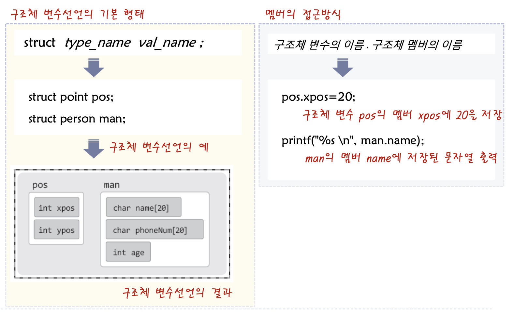

# 구조체란

## 구조체의 정의

- `구조체`란 관련된 데이터를 하나로 묶어 새로운 자료형을 정의하는 것을 말한다.
- `사용자 정의 자료형(user defined data type)`이라고도 한다.

```c
struct point // point라는 이름의 구조체 정의
{
	int xpos;  // point 구조체를 구성하는 멤버 xpos
	int ypos;  // point 구조체를 구성하는 멤버 ypos
};
```

- 배열도 구조체의 멤버로 선언이 가능하다.

```c
struct person
{
	char name[20];      // 이름 저장
	char phoneNum[20];  // 전화번호 저장
	int age;            // 나이 저장
};
```

## 구조체 변수의 선언과 접근



예제

```c
struct point  // 구조체 point의 정의
{
	int xpos;
	int ypos;
};

int main(void)
{
		struct point pos1, pos2;  // 구조체 변수 선언
		double distance;
		fputs("point1 pos: ", stdout);
		scanf("%d %d", &pos1.xpos, &pos1.ypos);
		
		fputs("point2 pos: ", stdout);
		scanf("%d %d", &pos2.xpos, &pos2.ypos);
		
		/* 두 점선과의 거리 계산 공식 */
		// sqrt는 헤더파일 math.h에 선언된 함수
		distanve=sqrt((double)(pos1.xpos-pos2.xpos) * (pos1.xpos - pos2.xpos) + 
						 (pos1.ypos - pos2.ypos) * (po1.ypos - pos2.ypos)));
	  printf("두 점의 거리는 %g 입니다. \n", distance);
	  return 0;
}
	
```