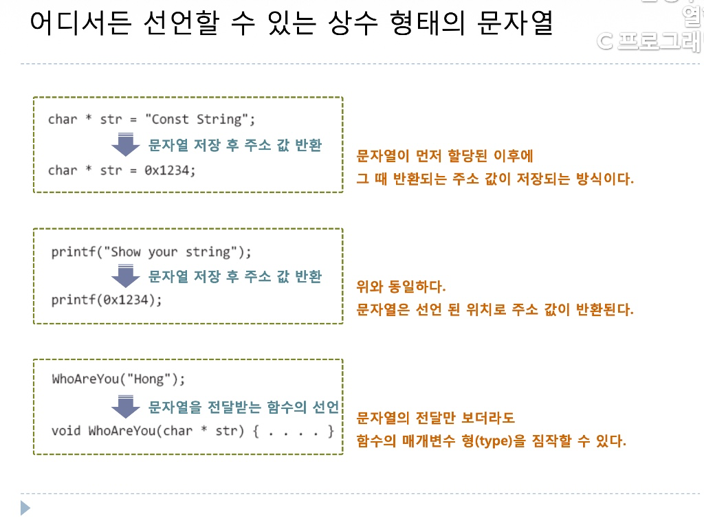

# 상수 형태의 문자열과 변수 형태의 문자열

## 두 가지 형태의 문자열

```c
// 변수 형태의 문자열
char str1[] = "My String";
// 상수 형태의 문자열
char * str2 = "Your String";
```

#### 1. 상수 형태의 문자열

- C언어에서 큰따옴표로 적은 문자열 `“….”` 즉, 문자열 리터럴은 `시작 문자의 메모리 주소값`으로 바뀐다.
    - 코드에 `“Const String”` 이라고 적으면 컴파일러는 이 문자열을 `읽기 전용 메모리(상수 영역)`에 배치 해둔다.
    - 그리고 `Const String` 은 해당 문자열이 저장된 메모리 시작 주소값(첫 글자 주소 값) 으로 치환된다.



- **첫 번째 박스: `char *str = "Const String";`**
    - 컴퓨터는 먼저 `"Const String"`을 메모리 어딘가(예: `0x1234`)에 저장한다.
    - 그리고 그 위치의 주소값 `0x1234`를 반환하여 결국 `char *str = 0x1234;`를 실행한다.
    - 결과적으로 포인터 변수 `str`은 문자열의 첫 글자 `'C'`의 주소를 가리키게 된다.
- **두 번째 박스: `printf("Show your string");`**
    - `printf` 함수에 문자열 전체를 통째로 넘겨주는 것처럼 보이지만, 실제로는 `"Show your string"`이 저장된 주소값(`0x1234`)을 넘겨주는 것이다.
    - 즉, `printf(0x1234);` 형태로 호출되는 셈이다.
    - `printf`는 `0x1234` 주소로 찾아가 널 문자가 나올 때까지 문자를 하나씩 출력한다.
- **세 번째 박스: `WhoAreYou("Hong");`**
    - `"Hong"` 역시 주소값(`char *`)을 반환한다.
    - 따라서 `WhoAreYou`라는 함수를 만들 때 매개변수 타입을 문자열 자체가 아니라 주소를 받을 수 있는 포인터 타입 `char *str`로 선언해야 하는 이유를 보여준다.

#### 2. 변수 형태의 문자열

변수 형태의 문자열은 먼저 문자열 리터럴을 읽기 전용 메모리에 저장한 후 `My String\0` 을 새로 생성된 `str1` 메모리 공간으로 복사한다.

복사가 완료되면 두 공간은 완전히 분리된다.

- **상수 영역의 `"My String"`:** 원본 리터럴 데이터 (수정 불가)
- **스택 영역의 `str1`:** 원본에서 복사해 온 **독립된 본인 소유의 메모리 공간** (수정 가능)